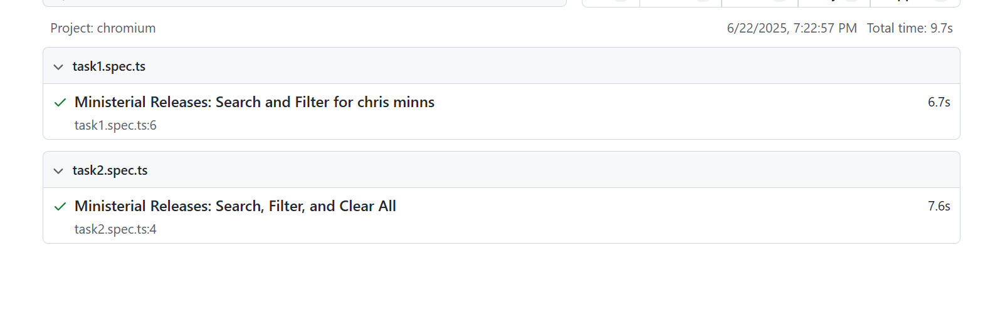

 **NSW Media Releases - Apply filters and reset filters**

This project automates testing for the NSW Government Media Releases page to verify that filters applied by Minister name work correctly, and that clearing filters resets the page state.

**Purpose**
1. Validate that selecting a Minister from the "Ministers" filter list updates the media release cards accordingly
2. Verify that  clicking on "Clear all filters" resets the UI and media release list to its original state.

3. Verify dynamic testing that allowing any Minister’s name to be used as input.

**Technologies used : **

- [Playwright](https://playwright.dev/) – Automation Framework
- Typescript(Node.js)
- Playwright Test Runner

**Instructions for Setup
**
1. Clone the Repository
git clone https://github.com/shilpakatoch/Revenue.git

2. Install Dependencies
npm init playwright@latest

3. How to Run Tests
Run all tests:
npx playwright test

4. Run a specific test file (optional):

npx playwright test tests/filename.spec.ts

5. Dynamic Input for Minister Name
Inside the test script (task1.spec.ts), the Minister name is stored in a variable like this:

var ministerName = 'The Minister name';
To test with other ministers (e.g., "Deputy Premier"), simply change the value of that variable:

6. Run command to see results and report 
npx playwright show-report

